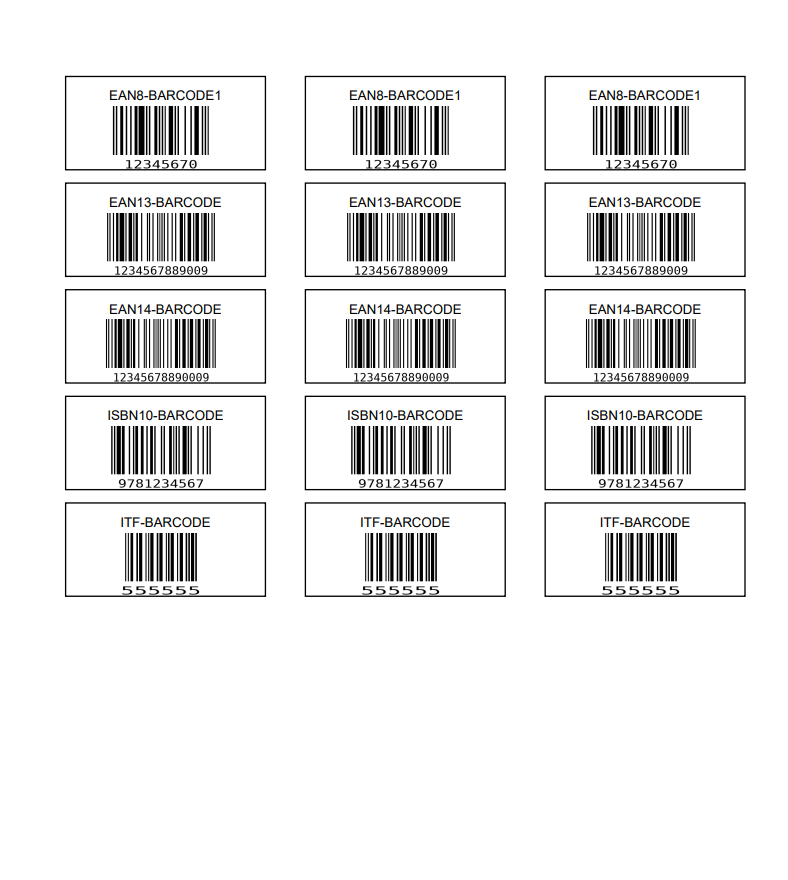

# Güncelleme

* Program artık son haline gelmiştir

# Derleme 

* öncelikle derleme kısmında çok efor sarfetmenize gerek yok gerekli kütüphaneleri indirmek için :


``` pip install -r reqs.txt```
* komutunu çalıştırmanız yeterli

```python

compile_to_files = {
    r"path\to\filename.py",
    "dbg":True # bu True olduğunda program açıldığında konsol açılacaktır açılmasını istemiyorsanız False yapmanız yeterli hata ayıklama için önerilir
    "pyside6":True, # eğer ki program gui tabanlı ise bunu aktif etmeniz gerekir yoksa program çalışmaz
    "extra_files":[
        "src":r"path\to\sources", # kaynak dosya
        "dst":r"path\to\extract\sources" # eklenen içeriğin nereye çıkarılacağı
    ]
}

compile_with_nuitka(False,**compile_to_files): # eğer ki parametreyi görmek istiyorsanız False değerini true yapmalısınız böyle yaptığınızda derleme işlemi yapılmayacaktır
```

 * Direkt derlemek için :


```python build.py```

* Komutunu yazmanız yeterli

# Programlar

* db_main - veritabanına barkod eklemek için

* main_window - ana uygulama barkod pdf'i oluşturmak için

* remove_item - veritabanındaki bir itemi silmek için

* uninstall - programı silmek için

# Ornek bir pdf



  
